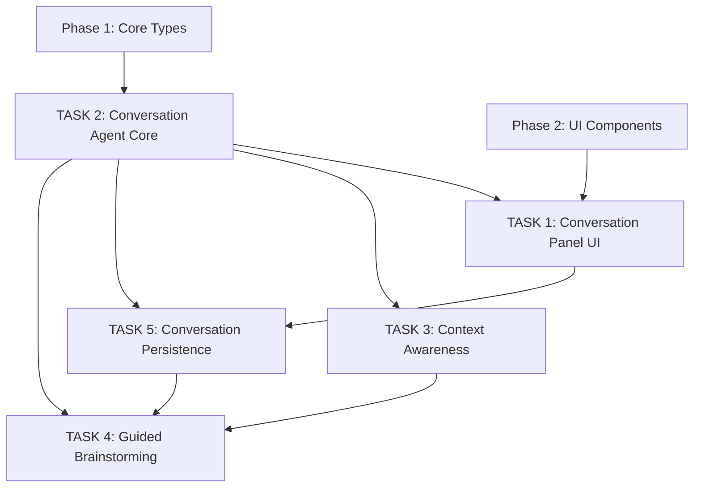

# Phase 3: AI Conversation Agent

This document describes the planned third phase — integrating an AI conversation agent for interactive discussion of application improvements.

**Status**: 📋 Planned

---

## Overview

**Goal**: Create an AI-powered conversation system where users can discuss application improvements, report issues, and brainstorm features in natural language — directly within the application.

**Problem**: Traditional issue reporting requires users to switch context (leave the app, open GitHub, write an issue from memory). This leads to lost context, vague descriptions, and underreporting of issues.

**Solution**: Embed an AI conversation agent that:

- Understands the application context (current component, screen state)
- Guides users through structured feedback collection
- Detects user intent (bug report, feature request, question)
- Generates structured output for issue creation

**Benefit for humanity**: Democratizing software feedback by enabling anyone — regardless of technical skill — to contribute meaningful improvement suggestions through natural conversation with an AI assistant.

---

## Planned TASKs

### TASK 1: Conversation Panel UI

**Title**: `Create chat-like conversation panel`

**Priority**: Critical

**Description**:
Build the Conversation tab panel with a chat-like interface for AI dialogue.

**Tasks**:

- [ ] Create `src/components/ConversationPanel.tsx`
- [ ] Message list with user/assistant/system bubbles
- [ ] Text input area with send button
- [ ] Typing indicator when AI is processing
- [ ] Auto-scroll to newest message
- [ ] Message timestamps display
- [ ] Conversation suggestions as quick-reply buttons
- [ ] Clear history button
- [ ] Responsive layout within window

**Acceptance criteria**:

- [ ] Chat displays messages with correct roles and styling
- [ ] Users can send messages and see AI responses
- [ ] Typing indicator shows during processing
- [ ] Suggestions are clickable and send as messages
- [ ] History clears correctly

**Labels**: `ui`, `conversation`, `chat`

---

### TASK 2: Conversation Agent Core

**Title**: `Implement AI conversation agent with intent detection`

**Priority**: Critical

**Description**:
Create the core conversation agent that processes user messages, detects intent, and generates contextual responses.

**Tasks**:

- [ ] Create `src/lib/conversation-agent.ts`
- [ ] Implement intent detection (improvement, bug, feature, question, task, general)
- [ ] Build response generation pipeline
- [ ] Integrate with `ComponentRegistry` for contextual understanding
- [ ] Support both Russian and English input/output
- [ ] Generate follow-up questions based on intent
- [ ] Maintain conversation state and history
- [ ] Provider-agnostic AI backend interface (pluggable LLM)

**Acceptance criteria**:

- [ ] Agent correctly classifies user intent
- [ ] Responses are contextually relevant
- [ ] Works in both Russian and English
- [ ] Backend is pluggable (local LLM, API, mock)
- [ ] Conversation history is maintained

**Labels**: `ai`, `conversation`, `intent-detection`

---

### TASK 3: Context Awareness

**Title**: `Add application context awareness to conversation agent`

**Priority**: High

**Description**:
Enable the AI agent to understand the current application state — which component is selected, what the user is looking at, and any relevant metadata.

**Tasks**:

- [ ] Create `src/lib/context-analyzer.ts`
- [ ] Capture current component context via `ComponentRegistry`
- [ ] Accept screen position information
- [ ] Accept selected text or code snippets
- [ ] Build context summary for AI prompt enrichment
- [ ] Allow users to manually "show" a component to AI

**Acceptance criteria**:

- [ ] AI responses reference current component context
- [ ] Context information is attached to conversation messages
- [ ] Manual context sharing works ("look at this component")

**Labels**: `ai`, `context`, `awareness`

---

### TASK 4: Guided Brainstorming

**Title**: `Implement guided brainstorming mode for idea generation`

**Priority**: Medium

**Description**:
Create a structured brainstorming mode where the AI guides users through a series of questions to develop improvement ideas.

**Tasks**:

- [ ] Define brainstorming flow templates
- [ ] Implement step-by-step guided conversation
- [ ] Track brainstorming progress
- [ ] Summarize brainstorming results
- [ ] Enable transition from brainstorming to issue draft

**Acceptance criteria**:

- [ ] AI guides through structured questions
- [ ] Progress is visible to the user
- [ ] Results can be converted to issue drafts

**Labels**: `ai`, `brainstorming`, `workflow`

---

### TASK 5: Conversation Persistence

**Title**: `Implement conversation history persistence and management`

**Priority**: Medium

**Description**:
Enable saving, loading, and managing conversation sessions across browser sessions.

**Tasks**:

- [ ] Integrate with existing `loadConversationSession` / `saveConversationSession` utilities
- [ ] Auto-save conversation on each message
- [ ] Session title auto-generation from first messages
- [ ] Multiple session support with session list
- [ ] Session export/import functionality
- [ ] Storage quota management

**Acceptance criteria**:

- [ ] Conversations persist across page reloads
- [ ] Multiple sessions can be saved and switched
- [ ] Auto-save happens transparently
- [ ] Storage cleanup prevents quota issues

**Labels**: `persistence`, `conversation`, `storage`

---

## Dependency Diagram

---

## Effort Estimation

| TASK                        | Complexity | Priority | Dependencies     |
| --------------------------- | ---------- | -------- | ---------------- |
| 1. Conversation Panel UI    | Medium     | Critical | Phase 2 (window) |
| 2. Conversation Agent Core  | High       | Critical | Phase 1 (types)  |
| 3. Context Awareness        | Medium     | High     | TASK 2           |
| 4. Guided Brainstorming     | Medium     | Medium   | TASK 2           |
| 5. Conversation Persistence | Low        | Medium   | TASK 1, TASK 2   |

**Execution order**:

1. TASK 2 (agent core — can be developed independently)
2. TASK 1 (panel UI — connects agent to the window)
3. TASK 3 + TASK 5 (in parallel — context awareness and persistence)
4. TASK 4 (guided brainstorming — builds on all previous)

---

**Back to [README](../../README.md)**
