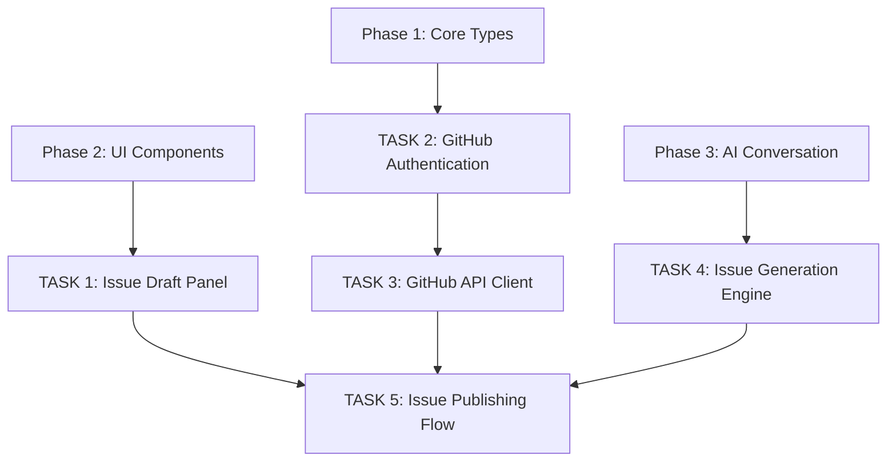

# Phase 4: GitHub Integration

This document describes the planned fourth phase — integrating with the GitHub API for automated issue creation and management.

**Status**: 📋 Planned

---

## Overview

**Goal**: Enable automated creation of GitHub issues directly from GOD MODE, transforming AI conversation outcomes into actionable development tasks.

**Problem**: After discussing improvements with the AI, users currently have to manually create GitHub issues, losing conversational context and the structured format generated by the AI.

**Solution**: Build a complete GitHub integration pipeline:

- OAuth/PAT authentication for GitHub access
- Automatic issue creation from AI-generated drafts
- Label management and template support
- Direct links to created issues

**Benefit for humanity**: Bridging the gap between user experience and developer workflow. Every user conversation about improvement can become a tracked, structured development task — ensuring that valuable feedback is never lost.

---

## Planned TASKs

### TASK 1: Issue Draft Panel

**Title**: `Create issue draft creation and editing panel`

**Priority**: Critical

**Description**:
Build the Issues tab panel for creating, editing, previewing, and managing issue drafts.

**Tasks**:

- [ ] Create `src/components/IssueDraftPanel.tsx`
- [ ] Issue draft editor with title, description, type, and priority fields
- [ ] Template selector (Bug Report, Feature Request, Improvement)
- [ ] Label management with suggestions
- [ ] Markdown preview for issue body
- [ ] Draft list with save/load/delete
- [ ] Validation warnings and errors display
- [ ] "Create from conversation" button integration

**Acceptance criteria**:

- [ ] Users can create and edit issue drafts
- [ ] Templates pre-fill appropriate fields
- [ ] Validation shows errors before submission
- [ ] Drafts persist in localStorage
- [ ] Conversation context can be attached

**Labels**: `ui`, `issues`, `panel`

---

### TASK 2: GitHub Authentication

**Title**: `Implement GitHub OAuth and PAT authentication`

**Priority**: Critical

**Description**:
Build authentication flow for GitHub API access, supporting both Personal Access Tokens (PAT) and OAuth Device Flow.

**Tasks**:

- [ ] Create `src/lib/github-auth.ts`
- [ ] Implement PAT token input and validation
- [ ] Implement OAuth Device Flow authentication
- [ ] Secure token storage in localStorage
- [ ] Token refresh and expiration handling
- [ ] Create `src/components/GitHubAuthButton.tsx`
- [ ] Compact and full auth button modes
- [ ] Connection status indicator

**Acceptance criteria**:

- [ ] Users can authenticate via PAT or OAuth
- [ ] Token is stored securely
- [ ] Auth status is clearly displayed
- [ ] Invalid tokens show appropriate errors

**Labels**: `github`, `auth`, `oauth`

---

### TASK 3: GitHub API Client

**Title**: `Create GitHub API client for issue management`

**Priority**: Critical

**Description**:
Build a GitHub API client for creating issues, managing labels, and fetching repository information.

**Tasks**:

- [ ] Create `src/lib/github-api.ts`
- [ ] Implement issue creation (`POST /repos/{owner}/{repo}/issues`)
- [ ] Implement label fetching and creation
- [ ] Implement issue template fetching
- [ ] Repository information retrieval
- [ ] Rate limiting and error handling
- [ ] Retry logic for transient failures

**Acceptance criteria**:

- [ ] Issues are created successfully in the target repository
- [ ] Labels are applied automatically
- [ ] Missing labels are created in the repository
- [ ] API errors are handled gracefully

**Labels**: `github`, `api`, `integration`

---

### TASK 4: Issue Generation Engine

**Title**: `Implement AI-powered issue draft generation from conversations`

**Priority**: High

**Description**:
Build the engine that transforms conversation context into structured GitHub issue drafts using AI.

**Tasks**:

- [ ] Create `src/lib/issue-generator.ts`
- [ ] Parse conversation to extract requirements and context
- [ ] Generate structured title from conversation summary
- [ ] Generate markdown body from conversation + template
- [ ] Auto-detect issue type and priority from conversation
- [ ] Suggest relevant labels based on content
- [ ] Calculate confidence score for generated draft
- [ ] Support bilingual generation (Russian/English)

**Acceptance criteria**:

- [ ] Generated drafts are well-structured and relevant
- [ ] Type and priority detection is accurate
- [ ] Labels are appropriate for the content
- [ ] Confidence score reflects draft quality

**Labels**: `ai`, `issues`, `generation`

---

### TASK 5: Issue Publishing Flow

**Title**: `Implement complete publish-to-GitHub flow`

**Priority**: High

**Description**:
Build the end-to-end flow from draft to published GitHub issue, including confirmation, feedback, and linking.

**Tasks**:

- [ ] Publish confirmation dialog
- [ ] Show preview of what will be created
- [ ] Handle publish success with link to issue
- [ ] Handle publish failure with retry option
- [ ] Update draft status after publishing
- [ ] Show notification with issue number and URL

**Acceptance criteria**:

- [ ] Users confirm before publishing
- [ ] Success shows clickable link to issue
- [ ] Failures show clear error and retry option
- [ ] Draft status updates to "published"

**Labels**: `github`, `publish`, `workflow`

---

## Dependency Diagram

---

## Effort Estimation

| TASK                       | Complexity | Priority | Dependencies           |
| -------------------------- | ---------- | -------- | ---------------------- |
| 1. Issue Draft Panel       | Medium     | Critical | Phase 2 (window)       |
| 2. GitHub Authentication   | High       | Critical | Phase 1 (types)        |
| 3. GitHub API Client       | High       | Critical | TASK 2                 |
| 4. Issue Generation Engine | High       | High     | Phase 3 (conversation) |
| 5. Issue Publishing Flow   | Medium     | High     | TASK 1, TASK 3, TASK 4 |

**Execution order**:

1. TASK 2 (authentication — required for all API calls)
2. TASK 3 (API client — built on auth)
3. TASK 1 + TASK 4 (in parallel — UI panel and generation engine)
4. TASK 5 (publishing flow — combines everything)

---

## Risks and Mitigations

| Risk                           | Likelihood | Impact | Mitigation                         |
| ------------------------------ | ---------- | ------ | ---------------------------------- |
| OAuth complexity               | Medium     | High   | Use PAT as fallback authentication |
| GitHub API rate limits         | Low        | Medium | Implement caching and debouncing   |
| Token security in localStorage | Medium     | Medium | Warn users about shared machines   |
| Issue template parsing         | Low        | Low    | Fallback to default templates      |

---

**Back to [README](../../README.md)**
